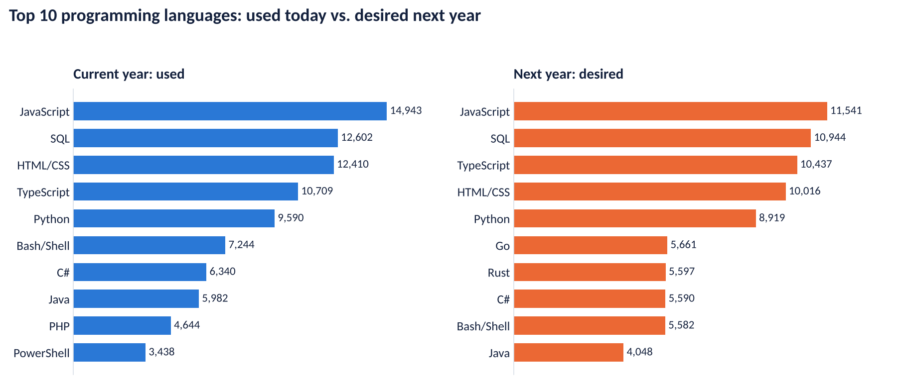
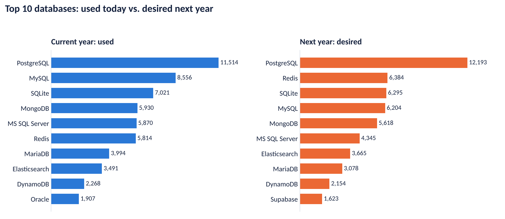
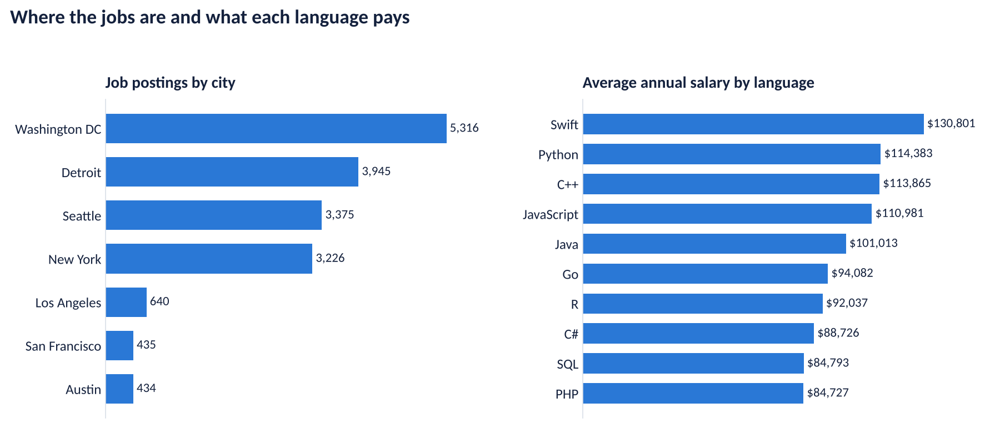
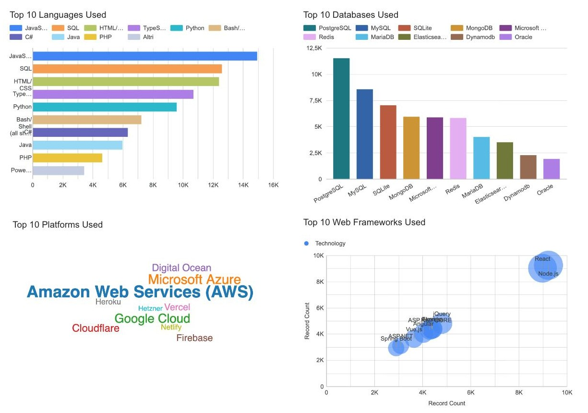
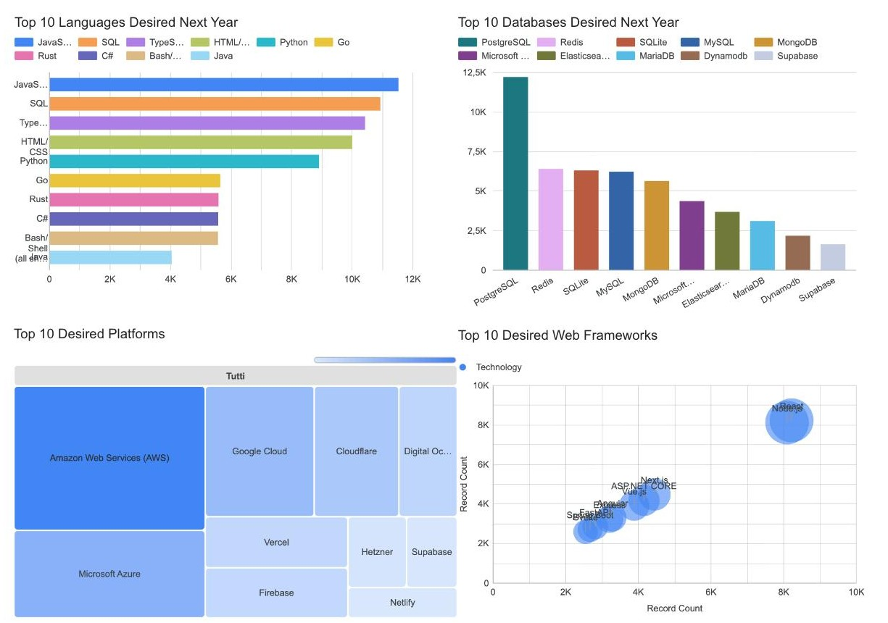
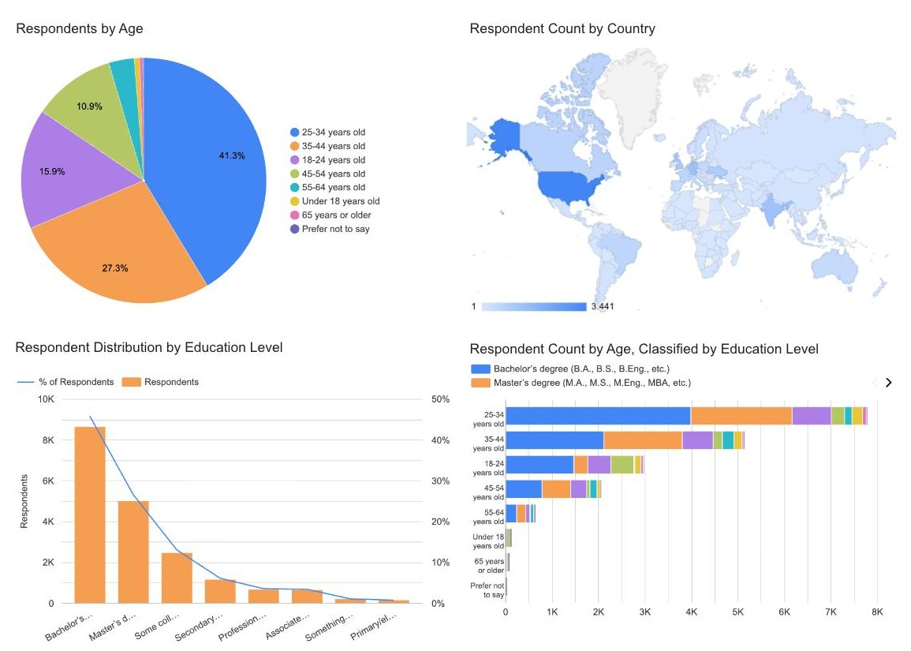

# Developer Technology Trends: Current Usage and Future Demand

**Which technology skills are in demand today, and which ones will developers adopt next?**
An end-to-end data analysis of job postings, salaries by programming language and the
Stack Overflow Developer Survey (65,437 responses), from data collection and cleaning to
an interactive dashboard and a stakeholder presentation.

Capstone project of the **IBM Data Analyst Professional Certificate**.


| Resource | Link |
|---|---|
| Presentation (PDF) | [Developer_Technology_Trends_Vincenzo_Ambrosino.pdf](presentation/Developer_Technology_Trends_Vincenzo_Ambrosino.pdf) |
| Presentation (PowerPoint) | [Developer_Technology_Trends_Vincenzo_Ambrosino.pptx](presentation/Developer_Technology_Trends_Vincenzo_Ambrosino.pptx) |
| Notebooks | [`notebooks/`](notebooks/) |

---

## Project objective

- **Business question:** which languages, databases, platforms and frameworks are used most today, which ones developers want to work with next year, and where the jobs and the best salaries are.
- **Audience:** hiring managers, HR and training teams, and job seekers planning their skills.
- **Value:** data-driven guidance on which technologies to learn, teach or hire for.

## Key results

**Where the jobs are, and what pays**
- **Washington DC (5,316)**, Detroit (3,945) and Seattle (3,375) lead job postings; New York follows closely (3,226).
- **Swift pays the most ($130,801)**; Python, C++ and JavaScript all exceed $110,000. SQL and PHP pay the least (~$84,700-$84,800), although SQL is one of the most used languages.

**What developers use, and what they want next** (18,845 survey respondents)
- **JavaScript, SQL and TypeScript** are both the most used and the most desired languages; JavaScript is #1 in both years (14,943 used, 11,541 desired).
- **Rust (5,597) and Go (5,661) enter next year's top 10**, while PHP and PowerShell drop out.
- **PostgreSQL** is the leading database today (11,514) and its lead grows next year (12,193); **Redis jumps from 6th to 2nd place** (6,384) and Supabase enters the top 10.
- AWS, Microsoft Azure and Google Cloud dominate cloud platforms; React and Node.js dominate web frameworks.

**Who answered, and how pay varies**
- Most respondents are 25-44 years old (68.6%) and hold a bachelor's or master's degree (72.3%); the United States has the most respondents (3,441), followed by Germany (1,339) and India (1,316).
- Median yearly compensation is **$65,000** overall and **$69,814** for full-time employees; it ranges from $143,000 in the United States to $16,749 in India (**8.5x**).
- Compensation correlates with work experience (**r = 0.41**, outliers removed) and rises with age, from about $25K (18-24) to a peak of about $110K (55-64).







### Recommendations

- **Job seekers:** combine a solid core (SQL, JavaScript/Python) with one emerging skill such as TypeScript, Rust or Go.
- **Companies:** plan training on TypeScript, Rust/Go and cloud platforms; teams relying on MySQL or Oracle may need migration plans.
- **Recruiters:** focus efforts on the cities with the most postings (Washington DC, Detroit, Seattle, New York).

> **Limitation:** the survey mainly reflects young, highly educated developers, mostly from the US and Europe, so results may not represent every market.

## Dashboard

The Google Looker Studio dashboard has three tabs: **Current Technology Usage**, **Future Technology Trends** and **Demographics**.



<details>
<summary>More dashboard tabs</summary>




</details>

## Data sources

| Data | Collection method | Used for |
|---|---|---|
| Job postings (`job-postings.xlsx`) | REST API (Flask) | Postings by US city |
| Salaries by language (`popular-languages.csv`) | Web scraping | Average salary by language |
| [Stack Overflow Developer Survey](https://survey.stackoverflow.co/) (65,437 responses × 114 columns), IBM Skills Network copy | CSV / SQLite download | Technology usage, demographics, compensation |

Download links for every dataset are listed in [`data/README.md`](data/README.md). The data is not stored in the repository: the notebooks download it when they run.

## Methodology

1. **Data collection:** job postings through a Jobs API, salaries through web scraping, survey data from the IBM Skills Network.
2. **Data wrangling (pandas):** removed 10 duplicate rows (65,447 to 65,437 responses); imputed missing categorical values with the mode (RemoteWork: 10,631 rows, "Hybrid"; EdLevel: 4,653 rows, "Bachelor's degree"); imputed missing ConvertedCompYearly (64%) with the median ($65,000), then normalized it with Min-Max and Z-score scaling; detected 978 compensation outliers with the IQR method (above $220,861).
3. **Exploratory analysis:** distributions, outliers and correlations with pandas, Matplotlib, Seaborn and SQL on SQLite.
4. **Visualization:** histograms, box, scatter, bubble, pie, stacked, line and bar charts.
5. **Dashboard:** multi-select answers split into a long table (18,845 respondents), null values excluded, built in Google Looker Studio.

## Tools

- **Python:** pandas, NumPy, Matplotlib, Seaborn, SciPy
- **SQL:** SQLite (`sqlite3`, `pandas.read_sql_query`)
- **Data collection:** Flask REST API, web scraping
- **BI & reporting:** Google Looker Studio, PowerPoint
- **Environment:** Jupyter Notebook

## Repository structure

```
.
├── notebooks/                  # analysis notebooks, numbered in pipeline order
├── data/                       # data sources and download links (data is not versioned)
├── images/                     # README charts and dashboard screenshots
├── presentation/
│   ├── Developer_Technology_Trends_Vincenzo_Ambrosino.pdf
│   ├── Developer_Technology_Trends_Vincenzo_Ambrosino.pptx
│   └── original/               # original capstone presentation
├── scripts/
│   └── make_readme_charts.py   # regenerates the README charts
├── requirements.txt
└── LICENSE
```

### Notebooks

| # | Notebook | What it does |
|---|---|---|
| 01 | [Data collection: Jobs API](notebooks/01_data_collection_jobs_api.ipynb) | Flask REST API serving the job-postings dataset |
| 02 | [Removing duplicates](notebooks/02_data_wrangling_removing_duplicates.ipynb) | Duplicate detection and removal, mode and median imputation |
| 03 | [Finding missing values](notebooks/03_data_wrangling_finding_missing_values.ipynb) | Missing-value profile and heatmap |
| 04 | [Imputing missing values](notebooks/04_data_wrangling_imputing_missing_values.ipynb) | Majority-value imputation of `RemoteWork` |
| 05 | [Normalization](notebooks/05_data_wrangling_normalization.ipynb) | Forward-fill, Min-Max and Z-score scaling of compensation |
| 06 | [EDA overview](notebooks/06_eda_overview.ipynb) | Job satisfaction, remote work, languages by country |
| 07 | [Data distribution](notebooks/07_eda_data_distribution.ipynb) | Distributions, languages used vs. desired, Pearson and Spearman correlation |
| 08 | [Outliers](notebooks/08_eda_outliers.ipynb) | 3-sigma and IQR outlier detection, correlation matrix |
| 09 | [Correlation](notebooks/09_eda_correlation.ipynb) | Compensation by country, compensation vs. experience |
| 10 | [SQL + visualization](notebooks/10_sql_data_visualization.ipynb) | Survey loaded into SQLite and queried with SQL |
| 11-18 | [Histograms](notebooks/11_viz_histograms.ipynb) · [Box plots](notebooks/12_viz_box_plots.ipynb) · [Scatter](notebooks/13_viz_scatter_plots.ipynb) · [Bubble](notebooks/14_viz_bubble_plots.ipynb) · [Pie](notebooks/15_viz_pie_charts.ipynb) · [Stacked](notebooks/16_viz_stacked_charts.ipynb) · [Line](notebooks/17_viz_line_charts.ipynb) · [Bar](notebooks/18_viz_bar_charts.ipynb) | Visualization of distribution, relationship, composition and comparison |

Each notebook starts with a short summary of its objective, data, tools and key results.

## How to run

```bash
git clone https://github.com/v-ambrosino/ibm-data-analyst-capstone.git
cd ibm-data-analyst-capstone
pip install -r requirements.txt
jupyter notebook notebooks/
```

The notebooks download their datasets automatically (internet connection required).

## About

**Vincenzo Ambrosino**. Built as the capstone of the IBM Data Analyst Professional Certificate (IBM Skills Network). The lab structure and datasets are provided by IBM; the analysis, dashboard and presentation are my own work.

Licensed under the [MIT License](LICENSE).
